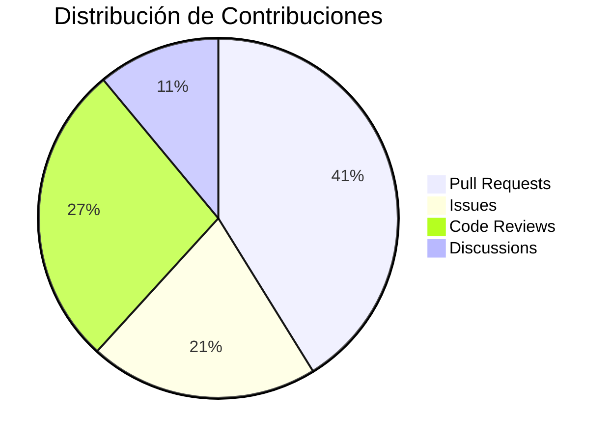

# 👋 ¡Hola! Soy Daniel Espinola

- 🚀 Desarrollador con 4 años de experiencia en tecnologías full-stack.
- 🌟 Apasionado por mejorar la experiencia del usuario y aplicar principios de Clean Code.
- 📫 ¿Quieres colaborar? Escríbeme a [britezespinola19@gmail.com](mailto:britezespinola19@gmail.com).

---

## 📊 Mis Estadísticas

## 🔥 Actividad

---

## 🚀 Tecnologías que uso

## 🏆 Mis Contribuciones

## 📈 Proyectos Destacados

| Proyecto | Tecnologías | Estrellas |
|----------|-------------|-----------|
| [API-Commerce](https://github.com/danielespinola/api-commerce) | Node.js, Express, MongoDB | ⭐ 24 |
| [React-Dashboard](https://github.com/danielespinola/react-dashboard) | React, TypeScript, Tailwind | ⭐ 18 |
| [Flutter-Notes](https://github.com/danielespinola/flutter-notes) | Flutter, Firebase | ⭐ 11 |

---

## 😺 Programando con estilo

<!-- 
Nota: Las estadísticas de Github mostradas arriba requieren:
1. Configurar el widget de github-readme-stats (https://github.com/anuraghazra/github-readme-stats)
2. Reemplazar "danielespinola" con tu nombre de usuario real de GitHub en cada URL
3. El gráfico de mermaid se mostrará automáticamente en GitHub si tu perfil README está bien configurado
-->
